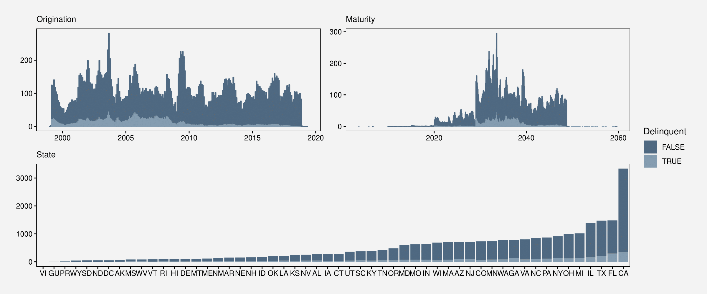
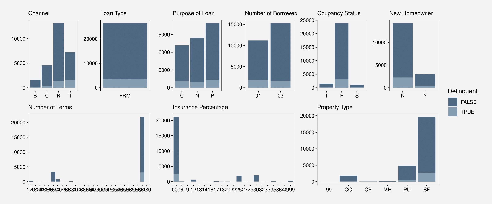
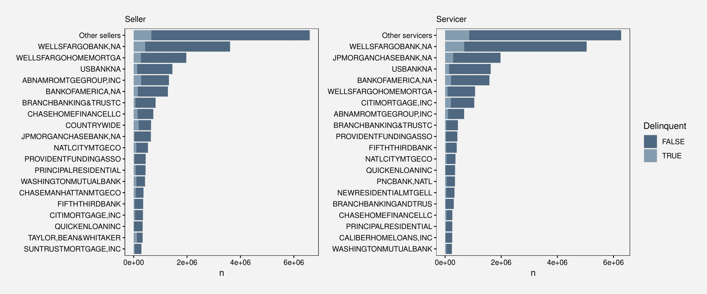
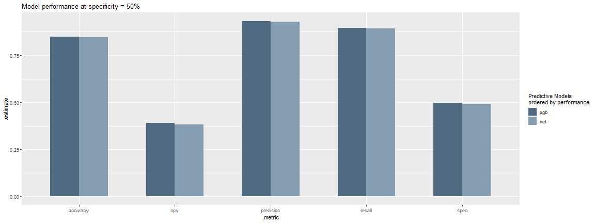

<style>
.reveal pre code {
  display: block;
  font-size: 1.5em;
  line-height: 1.1em;
  background-color: #E8E8E8;
  overflow: visible;
  max-height: none;
  word-wrap: normal;
}

.reveal section del {
  color: black;
  font-weight: bold;
}

.section .reveal .state-background {
   background: grey;
}

.reveal .controls div.navigate-left,
.reveal .controls div.navigate-left.enabled,
.reveal .controls div.navigate-left.enabled:hover{
  border-right-color: black;
}

.reveal .controls div.navigate-right,
.reveal .controls div.navigate-right.enabled,
.reveal .controls div.navigate-right.enabled:hover{
  border-left-color: black;
}

.reveal .progress span {
  background: black;
}

.reveal section img {
  border: none;
  box-shadow: none;
}
  

.exclaim .reveal .state-background {
  background: black;
} 

.exclaim .reveal h1,
.exclaim .reveal h2,
.exclaim .reveal p {
  color: white;
}

</style>


SDS Exam 2020
========================================================
author: Jess & Lars
date: 27-01-2020
autosize: true
width: 1920
height: 1080
navigation: section


Working with a subset
========================================================

Working with a subset

```r
load("../Total.rdata")
```


```r
nrow(total)
```

```
[1] 987500
```


```r
range(total$date)
```

```
[1] "1999-02-01" "2019-05-01"
```


```r
table(total$delic_binary)
```

```

 FALSE   TRUE 
861572 125897 
```

```r
table(total$first_complete_stop)
```

```

 FALSE   TRUE 
968441  19028 
```


Plots on full data 1
========================================================



Plots on full data 2
========================================================



Plots on full data 3
========================================================



Keras on full data
========================================================


```r
library(tidyverse)
library(ggthemes)
load("xgb_thold.jpg")
load("net_thold.jpg")
aa <- rbind(net_thold, xgb_thold)

ggplot(aa, aes(.metric, .estimate, fill = reorder(model, desc(.estimate)))) + 
  geom_col(position="dodge", width = 0.6) + 
  scale_fill_tableau(palette = "Miller Stone", type = "regular") + 
  labs(title="Model performance at specificity = 50%" , 
       fill="Predictive Models\nordered by performance")
```




Improvements
========================================================

 - reasons for dropout/censoring
   - refinancing?
   - reaching maturity/prepaid?
   - defaulting?
 - Better handeling of time aspect
 


Fannie Mae dataset
========================================================

 - Additional creditscores
 - Dropout reasons


